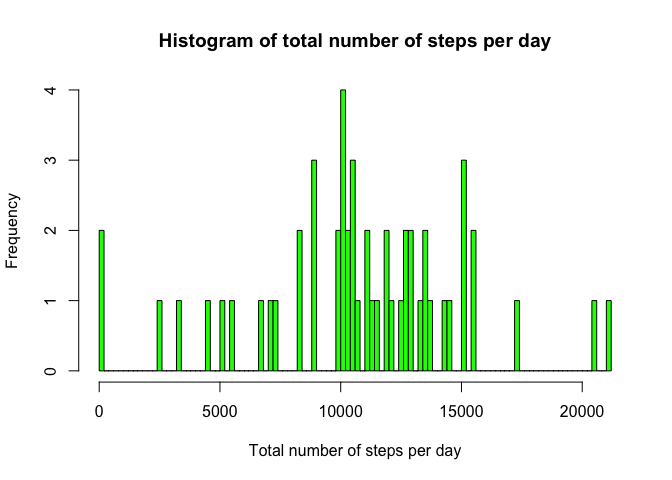
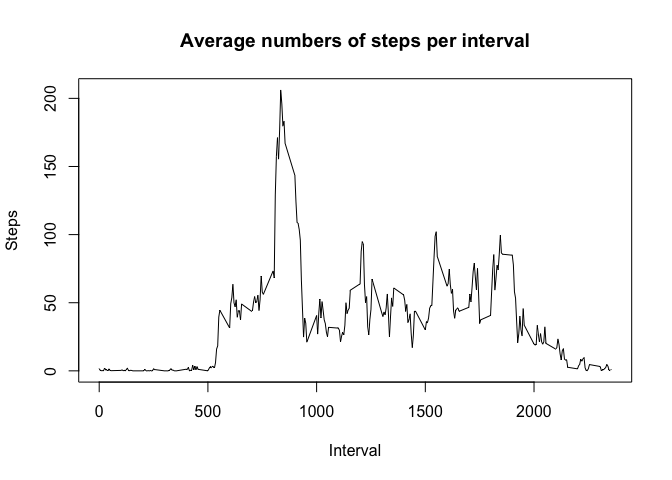
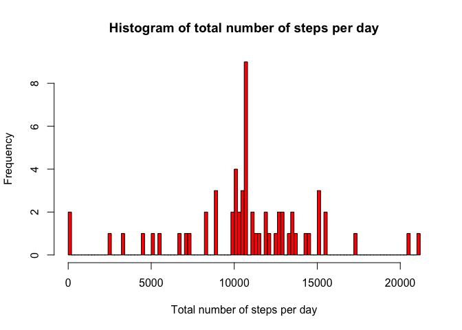
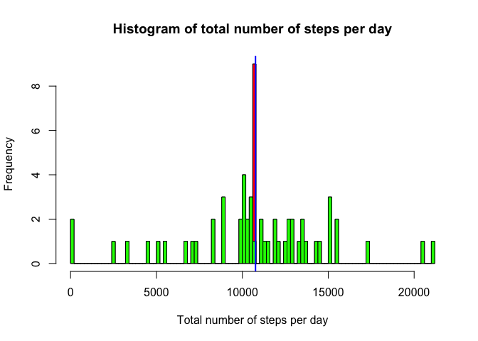
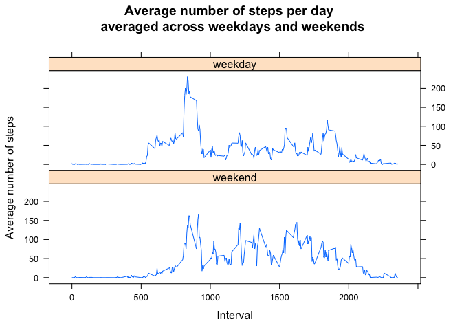

# Reproducible Research: Peer Assessment 1
Set your working direcotry to the folder that contains .zip file and install required packages:

* ggplot2
* scales

## Loading and preprocessing the data

Unzip file if required and load into the data frame.

```r
fileName <- "activity.csv"
if (file.exists(fileName)){
  dt <- read.csv(fileName)
} else{
  dt <- read.csv(unzip("activity.zip"))
}
dt$date <-as.Date(dt$date)
```

## What is mean total number of steps taken per day?

* Create new data frame without missing values
* Calculate total number of steps per day
* Plot a histogram of a total number of steps per day
* Calculate mean and median value of total number of steps per day


```r
dt_withoutNA <- dt[complete.cases(dt),]
dt_aggreagateByDate <-aggregate(.~date,data=dt_withoutNA,sum)
hist(dt_aggreagateByDate$steps,xlab="Total number of steps per day", main="Histogram of total number of steps per day",breaks=100,col="green")
```

 

```r
mean<-mean(dt_aggreagateByDate$steps)
median<-median(dt_aggreagateByDate$steps)
```
The mean and median total number of steps per day are equal to 10766.19 and 10765.00, respectively.

## What is the average daily activity pattern?

* Calculate average steps for each 5-minute interval
* Create new data frame with intervals and average number of steps per interval
* Plot an average number of steps per interval
* Find the interval with maximum number of steps


```r
dt_averageStepsByInterval <- aggregate(dt_withoutNA$steps,by=list(dt_withoutNA$interval),FUN=mean)
names(dt_averageStepsByInterval)<-c("interval","avg_steps")
plot(x=dt_averageStepsByInterval$interval,y=dt_averageStepsByInterval$avg_steps,type="l",main="Average numbers of steps per interval",xlab="Interval",ylab="Steps")
```

 

```r
maxSteps_interval<-dt_averageStepsByInterval[which.max( dt_averageStepsByInterval[,2] ),1]
maxSteps<-dt_averageStepsByInterval[which.max( dt_averageStepsByInterval[,2] ),2]
```
The interval 835 contains the maximum number of steps 206.17 on average across all the days in the dataset.

## Imputing missing values by the mean value for each 5-minute interval

* Find all rows with missing values and report that number
* Input the average number per interval instead of missin value for each interval
* Plot a histogram of a total number of steps per day using new data set with filled in missing values
* Calculate mean and median value of total number of steps per day using new data set with filled in missing values
* Compare with old values


```r
incomplete<-nrow(dt[!complete.cases(dt),])
new_dt<-dt
for (i in 1:length(new_dt$steps)){
  if (is.na(new_dt$steps[i]))
  {
    new_dt$steps[i]<-dt_averageStepsByInterval[which(dt_averageStepsByInterval$interval==new_dt$interval[i]),2]
  }
}
new_dt_aggreagateByDate <-aggregate(.~date,data=new_dt,sum)
hist(new_dt_aggreagateByDate$steps,xlab="Total number of steps per day", main="Histogram of total number of steps per day",breaks=100,col="red")
```

 

```r
new_mean<-mean(new_dt_aggreagateByDate$steps)
new_median<-median(new_dt_aggreagateByDate$steps)
```
Total number of rows with NA values is 2304. 

The mean and median total number of steps per day after filling in NA values are equal to 10766.19 and 10766.19, respectively. The imputing of missing values increases the frequency of total number of observations around the average value. The median increases and starts to be equal to the mean of the original data set. The shape of the histogram does not change significantly:


```r
hist(new_dt_aggreagateByDate$steps,xlab="Total number of steps per day", main="Histogram of total number of steps per day",breaks=100,col="red")
hist(dt_aggreagateByDate$steps,xlab="Total number of steps per day", main="Histogram of total number of steps per day",breaks=100,col="green",add=T)
abline(v = mean, col = "blue", lwd = 2)
```

 

## Are there differences in activity patterns between weekdays and weekends?

* Add a new factor for weekdays and weekends
* Plot an average number of steps per interval for weekdays and weekends


```r
library(lattice)
new_dt$date<-as.Date(new_dt$date)
week_days <- c('Monday', 'Tuesday', 'Wednesday', 'Thursday', 'Friday')
new_dt$weekDay <- factor((weekdays(new_dt$date) %in% week_days), 
         levels=c(FALSE, TRUE), labels=c('weekend', 'weekday'))
avg_new_dt<-aggregate(new_dt$steps,by=list(new_dt$weekDay,new_dt$interval),FUN=mean)
names(avg_new_dt)<-c("weekDay","interval","steps")
p <- xyplot(steps ~ interval | weekDay, data=avg_new_dt, type = 'l', main="Average number of steps per day \n averaged across weekdays and weekends", xlab="Interval", ylab="Average number of steps", layout=c(1, 2))
print (p) 
```

 

Note that the person has been more active during the weekends, as we would expect.
